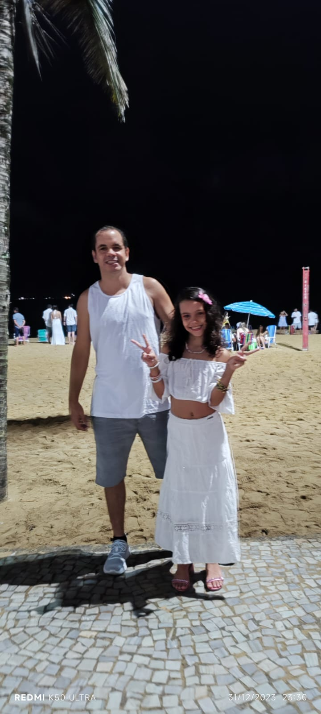

Desafio DevClub - Quem Sou EU
Este repositório contém uma página HTML que representa um desafio do DevClub. É uma introdução sobre mim, Alex Dyna, e algumas metas para o ano de 2024.

Quem sou Eu
Olá, sou Alex Dyna, mas meu nome é Walter Alexander Bastos Dyna. Sou o pai orgulhoso da Lorena, uma entusiasta do DevClub. Quando comprei o curso, ela aceitou o desafio de criar um site sobre o tempo. Confira aqui o site incrível que ela desenvolveu com o Rodolfo, aos 8 anos de idade.

Veja bem, se uma criança de 8 anos teve essa capacidade e entendimento, o que nos impede?

Minhas Metas para 2024
Ajudar minha família
Ser reconhecido como programador
Trocar de carro (O meu, só Deus)
Ter um apartamento para morar
Conseguir pagar as contas
Aprender inglês
Fazer uma viagem internacional
Links Úteis
Meu LinkedIn
Meu GitHub
Meu Netlify
Meu WhatsApp
Convites para o DevClub
Pessoas que eu adoraria ter no DevClub:

Lorena Dyna - Filha - Já está estudando comigo
Henrique Dyna - Irmão - Entrou na última turma do DevClub
Eduardo Dyna - Irmão - Vai entrar na próxima turma do DevClub
Bruno Calazans - Amigo - Vai entrar no DevClub
Vamos Ser DevClub - Bora!

Alex Dyna e Lorena Dyna

Este README fornece uma visão geral sobre o desafio do DevClub, destacando detalhes sobre o desafio, metas para o ano e convites para integrar o DevClub.